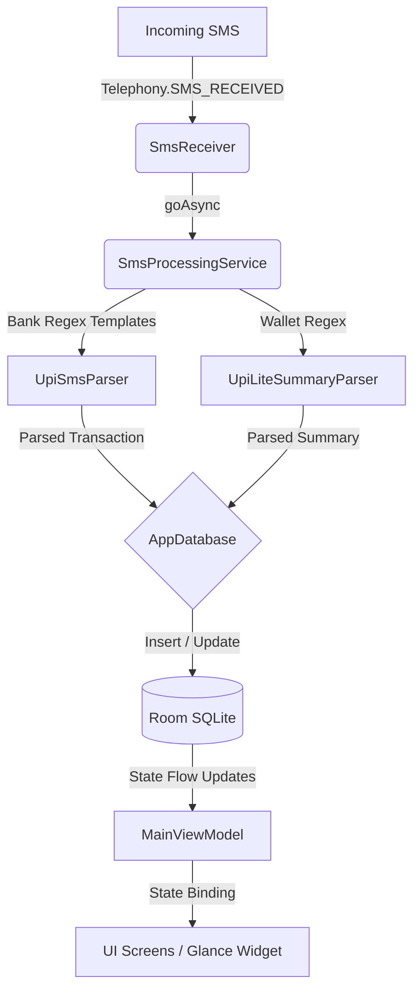

# UPI Expense Tracker & Diagnostics Engine

[](https://github.com/Harishhari0525/upitracker/actions/workflows/android-build.yml)
[](https://github.com/Harishhari0525/upitracker/actions/workflows/codeql.yml)

## 📌 Project Overview

**UPI Expense Tracker** is a highly secure, offline-first personal finance diagnostics and transaction tracking application built for Android using **Kotlin** and **Jetpack Compose**. The application runs entirely on-device, automatically intercepting and processing incoming SMS alerts for UPI (Unified Payments Interface) transactions. It maps out your burn rate, models month-end spending projections on custom canvas charts, parses transaction hashtags, manages category budgets with rollover systems, and exports clean PDF statements.

By prioritizing privacy, all transaction processing, database storage, and PDF rendering are performed locally without any server-side communication, analytical tracking, or cloud dependencies.

---

## 🛠 Tech Stack & Core Libraries

- **Language:** Kotlin 2.x
- **Build System:** Gradle (Kotlin DSL `build.gradle.kts`) with Version Catalogs (`libs.versions.toml`)
- **UI & Presentation:** Jetpack Compose, Material 3 (Expressive Tokens), Lottie (Animations)
- **Navigation:** Jetpack Navigation Compose with custom transition animations
- **Local Database:** Room SQLite ORM with custom migrations and indexing
- **Security & Encryption:** Google Tink AEAD (AES-GCM), Android Keystore, Biometric Prompt APIs, Proto DataStore
- **Background Tasks:** Jetpack WorkManager (Budget checking, Database cleanup, recurring payments scheduling)
- **Document Generation:** Native Android Graphics (`PdfDocument` API)
- **CI/CD:** GitHub Actions (Automated release pipeline, keystore signing, version matching)

---

## 📁 Repository Package Structure

```
upitracker/
├── .github/workflows/          # GitHub Actions CI/CD workflows (signing & releases)
├── app/
│   ├── release/                 # Output directory for production-signed APKS
│   ├── src/main/java/com/example/upitracker/
│   │   ├── data/                # Data layers: Room schemas, database definitions, and DAOs
│   │   ├── network/             # Network services: GitHub Release update checkers
│   │   ├── sms/                 # BroadcastReceivers, parsing services, regex engines
│   │   ├── ui/                  # Presentation Layer: Custom screens, reusable composables, themes
│   │   │   ├── components/      # UI Cards, Dialogs, Charts, and selectors
│   │   │   └── screens/         # Core feature screens and Navigation Hosts
│   │   ├── util/                # Workers, encryption managers, PDF helpers, and theme engines
│   │   ├── viewmodel/           # ViewModels orchestrating UI states and repository operations
│   │   └── widget/              # Jetpack Glance widgets for Android Home Screen Integration
│   └── build.gradle.kts         # Gradle configuration (minSdk=33, compileSdk=37)
├── gradle/                      # Version catalogs (libs.versions.toml) and wrappers
├── local.properties             # Local SDK path configurations
├── settings.gradle.kts          # Project definition and repositories config
└── README.md                    # Core project documentation
```

---

## ⚙️ Core Architecture & Subsystems



### 1. SMS Parsing Engine & Bank Registries
Located in the `sms/` package, this subsystem intercepts and parses financial SMS notifications with zero network dependency.
* **`SmsReceiver.kt`:** A `BroadcastReceiver` matching the `SMS_RECEIVED_ACTION` signature. It leverages `goAsync()` to spin up a coroutine on the `Dispatchers.IO` thread, avoiding Application Not Responding (ANR) flags.
* **`UpiSmsParser.kt`:** Integrates a two-phase parser:
  * *Phase 1 (Bank Templates):* High-accuracy, bank-specific regex templates targeting major Indian financial institutions (**HDFC, ICICI, Axis, SBI, Kotak, PNB, Bank of Baroda**). These capture:
    * Transaction amount (debit/credit)
    * Counterparty (merchant VPA or contact)
    * Account identifier (last 4 digits)
    * Balance after transaction
  * *Phase 2 (Fallback Regex):* Flexible fallback checking when templates don't match, screening keywords like `debited`, `credited`, `sent`, `paid`, and `salary`.
  * *Spam Verification:* Automatically discards promotional messages, card updates, OTPs, or failed transactions via strict keyword filters.
* **`UpiLiteSummaryParser.kt`:** Processes offline UPI Lite wallet logs (e.g. "X transactions worth Rs Y using your UPI Lite Wallet on Date") to record consolidated daily wallet transactions.
* **`SmsProcessingService.kt`:** A processing controller that manages database inserts, category categorization rules matching, WorkManager pacing alerts checks, and widget refreshes.

### 2. Room Database Schema & 23 Migrations
Located in the `data/` package, the data layer uses Room SQLite to structure storage with specific indices supporting fast sorting and query filtering.
* **`AppDatabase.kt`:** Manages the database instantiation, callback seeds, and **23 historical schema migrations** (e.g. migrating column types, adding indices, adding tables for budgets, recurring rules, and raw SMS history logs).
* **Entities:**
  * **`Transaction`:** Tracks logs containing amounts, debit/credit flags, timestamps, payees, notes, category mapping tags, balance levels, and local receipt image file paths. Unique constraint on `(amount, date, type)` prevents duplicate records.
  * **`Category`:** Stores categories mapping custom name keys, icon names, and hexadecimal colors.
  * **`Budget`:** Defines category limits, periods (weekly, monthly, yearly), and rollover toggles.
  * **`RecurringRule`:** Registers billing dates and intervals for subscriptions or EMIs.
  * **`CategorySuggestionRule`:** Holds classification rules containing text priorities, logic options (ANY/ALL), and matcher targets.
  * **`UpiLiteSummary`:** Consolidated wallet transactions by date and linked bank.
  * **`ArchivedSmsMessage`:** Raw SMS logs for recovery, analysis, and debugging.

### 3. Hardened Security & Encrypted Proto DataStore
Located in the `util/` package, the security layer encrypts stored credentials and preferences.
* **`CryptoManager.kt`:** A cryptographic wrapper integrating the **Google Tink AEAD** library. It initializes an `AesGcmKeyManager` backed by the hardware Android Keystore (`android-keystore://master_key`). Includes an automatic recovery loop: if the keyset is corrupted (e.g., during OS upgrades), it deletes the hardware alias, clears corrupted shared preferences, and generates a fresh slate.
* **`PinStorage.kt`:** Protects PIN credentials inside a Protocol Buffer-backed DataStore (`secure_user_prefs.pb`). Serializes user configuration parameters by encrypting/decrypting the byte streams on the fly using `CryptoManager` AEAD keys.
* **`BiometricHelper.kt`:** Evaluates biometric hardware capability and triggers system authentication dialogs using the `BiometricPrompt` API.

### 4. Interactive Diagnostics & Pacing (Insights Screen)
Renders a diagnostics dashboard in `ui/screens/InsightGridScreen.kt` using advanced algorithmic pacing:
* **Month-over-Month (MoM) Comparison:** Calculates percentage differences between your current monthly burn rate and the previous month, complete with status badges and textual summaries.
* **Safe Daily Pace Calculator:** Calculates the daily safe spending limit based on calendar days remaining and current budget limits.
* **Micro-Transaction Leak Detector:** Tracks and sums frequent small transactions (under ₹50) that silently drain your balance.
* **Lifestyle Balance Split:** Computes weekend vs. weekday spending proportions.
* **Smart Forecast Chart:** Renders a custom canvas line chart plotting actual cumulative spending, linear projected month-end burn rate, and a red warning line for the budget limit.
* **Hashtag Tracker (`TagUtils`):** Automatically extracts `#tags` from descriptions and notes, listing them by spending proportion. Clicking a tag slides open a modal bottom sheet showing its transaction history.

### 5. Native PDF Passbook Generator
Located in the `util/PdfGenerator.kt` file, this engine builds standard transaction statements using Android’s native graphics drawing APIs:
* **Layout and Pagination:** Paints table structures, dates, descriptions, debits, and credits on a 595x842 (A4 format) vector canvas. It splits multi-line descriptions dynamically using `Paint.breakText` and paginates when content exceeds the bottom margin.
* **Summaries and Charts:** Computes debit/credit totals and prints category-wise spending lists sorted by transaction volume at the end of the document.
* **Export Pipeline:** Streams compiled data straight into user-designated folders via the Storage Access Framework (SAF).

### 6. Background WorkManager Pipelines
Automated background tasks in `util/` keep data synchronized:
* **`BudgetCheckerWorker`:** Inspects category budget limits every 12 hours. Triggers a system push notification if spending exceeds 85% of a budget limit.
* **`MonthlyStatementWorker`:** Runs daily to check if the calendar month has rolled over. If so, it compiles the previous month's statement PDF and saves it to local downloads.
* **`RecurringTransactionWorker`:** Evaluates active subscription dates and automatically posts corresponding debit items when next due dates arrive.
* **`CleanupArchivedSmsWorker`** & **`PermanentDeleteWorker`:** Regularly purge obsolete database logs.
* **`UpdateCheckWorker`:** Checks for new GitHub release updates in the background.

---

## 📱 User Interface & Screen Matrix

The application's interface follows Material 3 design guidelines and expressive layouts:

| Screen Name | Location | Key Functionality |
| :--- | :--- | :--- |
| **Home (Default)** | [CurrentMonthExpensesScreen](file:///C:/Users/Haris/AndroidStudioProjects/upitracker/app/src/main/java/com/example/upitracker/ui/screens/CurrentMonthExpensesScreen.kt) | Total monthly spend, bank balances, velocity gauges, upcoming bills, and quick actions. |
| **Insights** | [InsightGridScreen](file:///C:/Users/Haris/AndroidStudioProjects/upitracker/app/src/main/java/com/example/upitracker/ui/screens/InsightGridScreen.kt) | Staggered metrics: MoM comparisons, daily pace tracking, micro-transaction leak metrics, hashtag tracker, and the custom canvas smart forecast. |
| **Graphs** | [GraphsScreen](file:///C:/Users/Haris/AndroidStudioProjects/upitracker/app/src/main/java/com/example/upitracker/ui/screens/GraphsScreen.kt) | Category spending pie charts, daily spend histograms, and multi-month income/expense trends. |
| **History** | [TransactionHistoryScreen](file:///C:/Users/Haris/AndroidStudioProjects/upitracker/app/src/main/java/com/example/upitracker/ui/screens/TransactionHistoryScreen.kt) | Comprehensive searchable transaction list with bulk select, delete/archive options, Swipe-to-Action support, filters, and receipt attachments. |
| **Budgets** | [BudgetScreen](file:///C:/Users/Haris/AndroidStudioProjects/upitracker/app/src/main/java/com/example/upitracker/ui/screens/BudgetScreen.kt) | Form and status bars displaying budget utilization with rollover. |
| **Passbook** | [PassbookScreen](file:///C:/Users/Haris/AndroidStudioProjects/upitracker/app/src/main/java/com/example/upitracker/ui/screens/PassbookScreen.kt) | Configuration panel to select date ranges, banks, and format options before triggering a PDF export. |
| **Data Management** | [DataManagementScreen](file:///C:/Users/Haris/AndroidStudioProjects/upitracker/app/src/main/java/com/example/upitracker/ui/screens/DataManagementScreen.kt) | CSV exports, database backup/restore operations, and database purging actions. |
| **Categorization Rules** | [RulesHubScreen](file:///C:/Users/Haris/AndroidStudioProjects/upitracker/app/src/main/java/com/example/upitracker/ui/screens/RulesHubScreen.kt) | Manager for rule sets that automatically map text keyword rules to specific category suggestions. |

---

## 🚀 Home Screen Widget Integration

Built with **Jetpack Glance** (in `widget/UpiExpenseWidget.kt`), the widget provides quick updates from the home screen:
* **Background Data Loading:** Fetches data asynchronously outside of the widget composition tree to keep the launcher responsive.
* **Toggle Tabs:** Toggle between **Today** vs **Month** spends using Glance `ActionCallbacks`.
* **Quick Add Expense:** Displays an `Add Expense` button that opens `MainActivity` and launches the transaction dialog immediately.

---

## 🔒 Push Notification Integration & Category Suggestions

Managed by `util/NotificationHelper.kt` and `util/CategorizeReceiver.kt`:
1. **Interactive Banners:** When a new transaction SMS is intercepted, a custom push notification displays the transaction details.
2. **One-Tap Categorization:** The notification presents three smart category suggestions based on merchant name matching. Tap a category action button to categorize the transaction directly from the drawer banner.

---

## ⚙️ Build and Development Setup

### Prerequisites
* **Android Studio** (Hedgehog / Koala or newer recommended).
* **JDK 17** configured in project settings.
* Android SDK Platform **API Level 33** (minSdk = 33, targetSdk = 37, compileSdk = 37).

### Development Steps
1. **Clone the repository:**
   ```sh
   git clone https://github.com/Harishhari0525/upitracker.git
   cd upitracker
   ```
2. **Open in Android Studio:**
   * Open the cloned directory, then let Gradle sync.
3. **Compile & Run Debug Configuration:**
   * Build the project via the terminal:
     ```sh
     ./gradlew assembleDebug
     ```
   * Connect an Android device (API 33+) or launch an emulator with SMS permissions, then click **Run** from the IDE.

---

## 📦 Continuous Delivery & Auto-Versioning

The project uses GitHub Actions for continuous delivery:
* **Build Workflow (`android-build.yml`):** Runs on push events to the `main` branch.
* **Dynamic Versioning:** The pipeline generates an incremental version string matching the sequence: `2.0.<github_run_number>` (e.g. `2.0.26`).
* **Gradle Integration:** Passes the version to the Gradle wrapper:
  ```sh
  ./gradlew assembleRelease -PversionName=2.0.<run_number>
  ```
* **Dynamic Property Extraction:** The Kotlin DSL build file ([app/build.gradle.kts](file:///C:/Users/Haris/AndroidStudioProjects/upitracker/app/build.gradle.kts#L20)) catches this variable and injects it into the AndroidManifest build config, ensuring that local releases and GitHub release tags are kept in sync.

---

## 📄 License
This project is licensed under the MIT License - see the `LICENSE` file for details.
